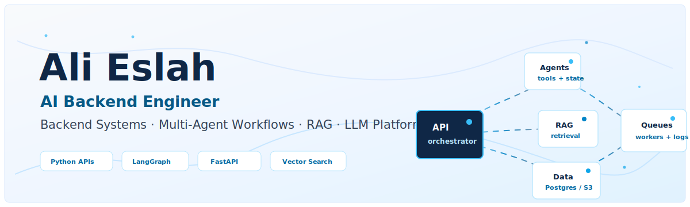
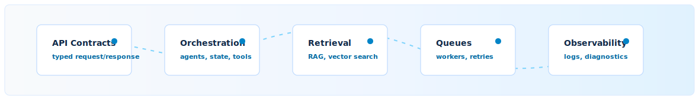
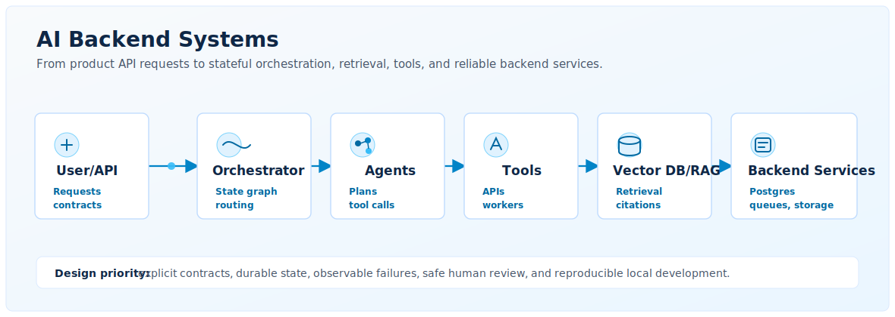

<div align="center">
  
</div>

<p align="center">
  <a href="https://alieslah.github.io/">
    
  </a>
  <a href="https://www.linkedin.com/in/ali-eslah/">
    
  </a>
  <a href="mailto:alieslah81@gmail.com">
    
  </a>
</p>

## AI Backend Engineer

I am a backend developer focused on building scalable backend systems and AI-powered platforms. My work combines Python, FastAPI, Django, NestJS microservices, multi-agent workflows, RAG pipelines, LLM orchestration, and production-oriented backend architecture.

I care about the parts that make AI systems useful beyond a demo: reliable workflows, explicit state, clear API contracts, safe human review, retrieval quality, background jobs, diagnostics, and maintainable backend boundaries.

<div align="center">
  
</div>

## What I Build

| Area | What it means in practice |
| --- | --- |
| **AI Backend Platforms** | FastAPI and Django services that expose reliable APIs for AI products, internal tools, and automation systems. |
| **Multi-Agent Workflows** | LangGraph and LangChain workflows with state, tools, retries, approval gates, and structured outputs. |
| **RAG & Knowledge Systems** | Ingestion, chunking, retrieval, vector search, citations, and answer generation for knowledge-heavy products. |
| **Backend APIs & Microservices** | Python and TypeScript services with clean boundaries, PostgreSQL persistence, queues, and Dockerized local stacks. |
| **Workflow Orchestration** | n8n integrations, custom LLM nodes, background workers, file processing, and operational automations. |
| **Real-time Backend Systems** | WebSocket and event-driven patterns for live product workflows and status-driven AI pipelines. |

## Core Expertise

| System layer | Engineering focus |
| --- | --- |
| **Architecture** | Service boundaries, workflow state, API design, data contracts, and practical production constraints. |
| **Reliability** | Retries, idempotency, audit trails, fallback behavior, validation, and visible failure modes. |
| **AI orchestration** | Agent graphs, tool calling, structured outputs, RAG flows, human-in-the-loop checks, and evaluation loops. |
| **Data movement** | Spreadsheet/file profiling, object storage, queues, vector stores, PostgreSQL models, and automation pipelines. |
| **Delivery** | Docker Compose environments, documented setup, testing paths, issue-driven iteration, and clear communication. |

## Tech Stack

**Backend**


**AI / LLM**


**Infrastructure**


**Data / Automation**


## Featured Repositories

| Project | Value proposition | Stack | Why it matters |
| --- | --- | --- | --- |
| [**AI Recruiting Decision Platform**](https://github.com/AliEslah/recruitment-agent) | Local-first recruiting decision support with AI-assisted scoring, interview planning, and human review. | FastAPI, PostgreSQL, SQLAlchemy, Alembic, LangGraph, LM Studio, Docker, Next.js | Shows production-minded AI backend design: RBAC, audit logs, redaction boundaries, workflows, tests, and documented local setup. |
| [**Personal AI Backend Portfolio**](https://github.com/AliEslah/AliEslah.github.io) | Static portfolio site for presenting backend, RAG, agentic workflow, and automation capabilities. | HTML, CSS, JavaScript, GitHub Pages | Creates a focused external landing page for recruiters, founders, and engineering teams without adding backend complexity. |
| [**Subtitle Translation Utility**](https://github.com/AliEslah/subtitle-translator) | Small Python automation experiment for batch subtitle translation to Persian. | Python, file processing, translation automation | Useful as a support project for automation and data-processing interests; intentionally not presented as a flagship system. |

## AI Backend Systems

<div align="center">
  
</div>

## Architecture Highlights

- **Agent orchestration:** stateful graph workflows, tool execution, structured responses, approval checkpoints, and clear escalation paths.
- **RAG pipelines:** ingestion, metadata handling, chunking, vector retrieval, context assembly, source-aware responses, and quality checks.
- **Backend reliability:** typed schemas, background jobs, queue-friendly design, retries, audit logs, and deterministic error handling.
- **Operational AI:** systems designed for observability, safe data boundaries, real users, and maintainable day-two behavior.
- **Workflow automation:** n8n custom nodes, spreadsheet/file profiling, API integrations, and repeatable internal operations.

## Current Focus

```txt
Agentic AI platforms
Multi-agent data analysis
RAG and knowledge workflows
Backend workflow orchestration
Reliable AI system design
Production-ready LLM integrations
```

## Currently Building / Selected Work Themes

Some work is private or client-facing, so I describe it by system type rather than exposing company names, private URLs, screenshots, or internal data.

| Theme | Public-safe description |
| --- | --- |
| **Agentic spreadsheet profiling** | Pipelines that inspect spreadsheet structure, infer data quality issues, and prepare reliable context for downstream analysis. |
| **Multi-agent data analysis** | Coordinated agents for analysis planning, tool execution, result review, and user-facing summaries. |
| **RAG & knowledge management** | Retrieval workflows for indexed knowledge bases, citations, and operational question answering. |
| **n8n LLM integrations** | Custom workflow nodes and API automations for LLM-assisted operations. |
| **AI workflow infrastructure** | Backend services, queues, object storage, vector stores, and diagnostics around AI workloads. |

## GitHub Stats

<p align="center">
  
  
</p>

## Contact

I am open to backend, AI platform, RAG, multi-agent workflow, and automation projects where reliability and product constraints matter.

<p>
  <a href="https://alieslah.github.io/">Portfolio</a> &nbsp;|&nbsp;
  <a href="https://www.linkedin.com/in/ali-eslah/">LinkedIn</a> &nbsp;|&nbsp;
  <a href="https://github.com/AliEslah">GitHub</a> &nbsp;|&nbsp;
  <a href="mailto:alieslah81@gmail.com">Email</a>
</p>
